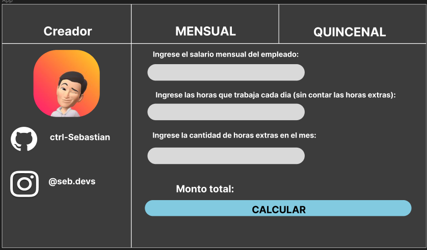

# HrExtras
### Este rograma fue creao con Python 3 usando tkinter, figma y proxlight.
HrExtras es un prgrama hecho en python fácil de usar que permite al usuario calcular el sueldo de un empleado luego de cumplir ciertas horas extras.

Este proyecto no está terminado, esta version está cumpliendo su objetivo principal, las futuras actualizaciones permitiran seleccionar si el pago será de una quincena o será mensual.

# Capturas

